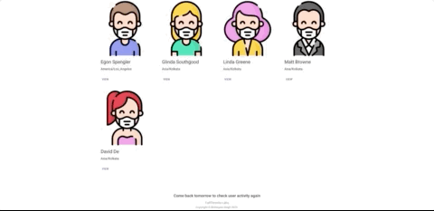

This project was created with React JS

## DEMO

You can see the deployed website at (using Firebase) - https://ftp-userdetails.web.app/

Calendar data can be found for 17th Oct, 18th Oct, 19th Oct 2020

Public Mock API (using Postman) - https://ff6684a7-d34a-40c2-8372-d5308d32ec20.mock.pstmn.io

## Tools Used

VSCode
Postman
Firebase

## libraries used

@material-ui
antd
react-big-calendar
moment
axios

## Run

### `npm install`

to install the packages

### `npm run build`

to check all productive code has reached to you safely, you might get an
error 'axios' not found. In that case, run the following command in your CLI and proceed -

`npm install axios`

Builds the app for production to the `build` folder. 
It correctly bundles React in production mode and optimizes the build for the best performance.

The build is minified and the filenames include the hashes. 
Your app is ready to be deployed!

### `npm start`

Runs the app in the development mode. 
Open [http://localhost:3000](http://localhost:3000) to view it in the browser.

